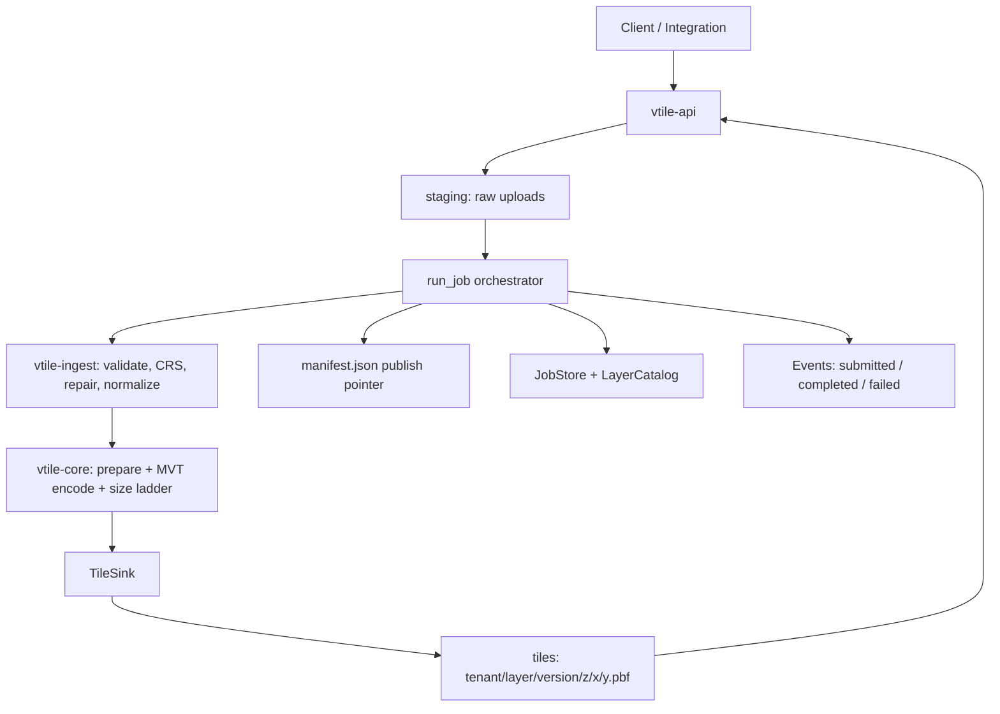

# Vector Tile Pipeline — Generating Mapbox Vector Tiles in Rust

[](https://github.com/Nicholas-Nguyen8742/rust-vtiles/actions/workflows/ci.yml)
[](LICENSE)
[](rust-toolchain.toml)

An end-to-end pipeline that ingests CRE geospatial datasets (parcels, zoning,
flood zones, submarkets, asset points) from GeoJSON and Shapefiles, converts
them to **Mapbox Vector Tiles (MVT v2)**, and publishes them for CDN
delivery — implemented as a Rust workspace, per the Vector Tile Ingestion
Pipeline TRD v0.1.

```text
GeoJSON / .zip Shapefile ─▶ normalize (EPSG:4326) ─▶ MVT tiles (.pbf, gzip)
   ─▶ tile storage (z/x/y) ─▶ manifest publish ─▶ HTTP/CDN delivery
```

## Generating MVT in Rust: your options

If you just want to produce `.pbf` tiles from Rust, the ecosystem offers:

| Option | What it gives you |
|---|---|
| [`mvt`](https://crates.io/crates/mvt) crate | Low-level MVT v2 encoder/decoder over protobuf-generated types (`Tile::new`, `create_layer`, geometry encoders) |
| [`geozero`](https://crates.io/crates/geozero) | Streaming, zero-copy conversion between many formats, including an MVT reader/writer (`GeozeroDatasource` → MVT) |
| [`tile-grid`](https://crates.io/crates/tile-grid) / [`squarepeg`](https://crates.io/crates/squarepeg) | Web Mercator XYZ tile math (tile ranges for bboxes, mercator transforms) |
| [`geo`](https://crates.io/crates/geo) + `geo-types` | Geometry primitives, bounding boxes, simplification (Ramer–Douglas–Peucker), validation |
| **Tippecanoe** (external binary) | The battle-tested large-dataset MVT generator; shell out via `std::process::Command` — what the TRD reference stack uses on Fargate |

A typical minimal pipeline is: parse source (`geojson`/GDAL) → reproject to
EPSG:4326 → bucket features into XYZ tiles (`tile-grid`) → encode each tile
(`mvt` or `geozero`) → gzip → upload to S3.

**This workspace takes a third path:** it implements the MVT v2 encoder
itself (~500 lines over the protobuf wire format) and all tile math, so the
entire pipeline builds with plain `cargo build` — no protobuf compiler, no
GDAL, no native libraries. That matters for CI and for the Fargate container
image, and it keeps the encoding fully testable via a bundled decoder. If you
later prefer `mvt`/`geozero`, only the encoder module swaps; everything
upstream/downstream is unchanged.

### Minimal example

```rust
use geo_types::{Coord, Geometry, LineString, Polygon};
use vtile_core::config::TileConfig;
use vtile_core::model::ZoomRange;
use vtile_core::sink::{MemoryTileSink, TileObjectMeta};
use vtile_core::tileset::{generate_tiles, prepare_features, RawFeature};

fn main() -> Result<(), Box<dyn std::error::Error>> {
    // One polygon feature with attributes (EPSG:4326 lon/lat).
    let feature = RawFeature {
        id: Some(1),
        geometry: Geometry::Polygon(Polygon::new(
            LineString::from(vec![
                Coord { x: -73.98521, y: 40.75293 },
                Coord { x: -73.98432, y: 40.75302 },
                Coord { x: -73.98441, y: 40.75368 },
                Coord { x: -73.98521, y: 40.75293 },
            ]),
            vec![],
        )),
        properties: serde_json::json!({
            "parcelId": "NYC-BB-12345",
            "market": "New York",
        })
        .as_object()
        .cloned()
        .unwrap_or_default(),
    };

    let config = TileConfig {
        layer_name: "parcel_boundary".into(),
        zoom_range: ZoomRange::new(12, 16),
        ..Default::default()
    };
    let prepared = prepare_features(vec![feature], &config);
    let sink = MemoryTileSink::new();
    let stats = generate_tiles(&prepared, &config, &TileObjectMeta::default(), &sink)?;
    println!("wrote {} gzipped MVT tiles", stats.tiles_written);
    Ok(())
}
```

## Workspace layout

| Crate | Responsibility |
|---|---|
| `crates/vtile-core` | MVT v2 encoder + decoder, Web Mercator tile math, geometry command encoding, simplification, tile-size mitigation ladder, `TileSink` trait, `generate_tiles` |
| `crates/vtile-ingest` | GeoJSON + zipped Shapefile (`.shp/.shx/.dbf/.prj`) readers, CRS detection/reprojection (WGS84, NAD83, EPSG:3857), geometry repair, validation, PII-aware property cleaning |
| `crates/vtile-pipeline` | Job orchestration (the TRD §10 workflow), manifests, local + S3 sinks, job/layer stores, lifecycle events, `vtile` CLI |
| `crates/vtile-api` | HTTP API (TRD §8): uploads, jobs, layers, tile serving with tenant isolation |

## Quickstart

Requires Rust ≥ 1.75 (`rustup` toolchain; see `rust-toolchain.toml`).

```bash
cargo test --workspace          # unit + end-to-end pipeline tests
```

### Local pipeline (one-command dev loop)

The full ingestion loop runs locally with no cloud dependencies — see
[`docs/LOCAL_DEV.md`](docs/LOCAL_DEV.md) for the walkthrough and
[`docs/ERRORS.md`](docs/ERRORS.md) for the failure taxonomy.

```bash
make setup      # build + generate shapefile fixtures + local data dirs
make run-local  # vtile-api on 127.0.0.1:8080 (foreground)

# second terminal:
make seed       # push every fixture through the upload API
make smoke      # end-to-end: upload -> tiles -> TRD §8.5 status contracts
make job-status JOB_ID=<jobId>
make replay-job TENANT=tenant-acme JOB_ID=<failed jobId> ASSUME_WGS84=1
```

### CLI: one-shot pipeline run

```bash
cargo run -p vtile-pipeline --bin vtile -- run \
  --tenant tenant-acme --layer us-parcels-nyc \
  --format geojson --category parcel \
  --input examples/data/nyc_parcels_sample.geojson \
  --data-dir ./data

# Decode a generated tile and print its structure:
cargo run -p vtile-pipeline --bin vtile -- \
  inspect-tile ./data/tiles/tenant-acme/us-parcels-nyc/versions/<version>/12/1206/1539.pbf
```

### HTTP API (local mirror of the production contracts)

```bash
cargo run -p vtile-api -- --data-dir ./data --port 8080
```

```bash
# 1. Create a job and get the upload URL (TRD §8.1)
curl -s -X POST localhost:8080/api/v1/ingest/uploads \
  -H 'Content-Type: application/json' \
  -d '{"tenantId":"tenant-acme","layerId":"us-parcels-nyc",
       "fileName":"nyc_parcels.geojson","sourceFormat":"GEOJSON",
       "metadata":{"name":"NYC Parcels","category":"PARCEL","tags":["parcel","nyc"]}}'

# 2. Upload the file (local stand-in for the S3 presigned PUT) and process
curl -s -X PUT localhost:8080/api/v1/ingest/uploads/{jobId}/content \
  --data-binary @examples/data/nyc_parcels_sample.geojson

# 3. Poll status (TRD §8.2), browse the catalog (TRD §8.3/8.4)
curl -s localhost:8080/api/v1/jobs/{jobId}
curl -s 'localhost:8080/api/v1/layers?tenantId=tenant-acme&category=PARCEL&market=NYC'

# 4. Fetch tiles (TRD §8.5: 200 tile / 204 empty / 403 / 404 / 422)
curl -s -o tile.pbf 'localhost:8080/tiles/tenant-acme/us-parcels-nyc/14/4821/6158.pbf'
```

## Architecture



Production mapping (TRD §2): the same domain code runs on AWS with API
Gateway + Lambda (uploads), S3 + SQS + Step Functions + ECS Fargate
(processing), DynamoDB (metadata), EventBridge (events), and CloudFront
(serving). Each AWS dependency sits behind a trait (`TileSink`, `JobStore`,
`LayerCatalog`, `EventEmitter`), so cutover is adapter work. See
[`docs/ARCHITECTURE.md`](docs/ARCHITECTURE.md) for the full mapping and the
production cutover checklist.

## TRD coverage

| TRD area | Where |
|---|---|
| §3 formats (GeoJSON, zipped Shapefile) | `vtile-ingest/src/{geojson,shapefile}` |
| §4 normalization (EPSG:4326, repair, PII strip, 7-decimal precision) | `vtile-ingest/src/{crs,repair,normalize}.rs`, `docs/PRECISION.md` |
| §5 MVT v2 / zoom strategy / 250 KB–750 KB size ladder | `vtile-core/src/{mvt,config,tileset}.rs` |
| §6 S3 layout (`staging/`, `tiles/`, `manifests/`, retention) | `vtile-pipeline` sinks/manifest, `terraform/s3.tf` |
| §7 data models (job, layer metadata, CRE properties) | `vtile-core/src/model.rs` |
| §8 API contracts | `vtile-api/src/routes/*` |
| §9 events (submitted/completed/failed) | `vtile-pipeline/src/events.rs` |
| §10 12-state workflow | `vtile-pipeline/src/job.rs` |
| §10 validation gates + error taxonomy | `vtile-ingest/src/validate.rs`, `docs/ERRORS.md` |
| §11 AWS components | `terraform/` scaffold (S3, SQS, Step Functions, ECS, CloudFront, DynamoDB, KMS, IAM) |
| §13 security (tenant isolation, CORS, SSE-KMS, PII) | `vtile-api/src/auth.rs`, property denylist, `terraform/kms.tf` |
| §14 NFRs (idempotency, atomic publish/rollback, retries) | `job.rs` idempotency guard, manifest swap, SQS redrive ×3 |
| DLQ/quarantine/replay workflow | `vtile-pipeline/src/{quarantine,replay}.rs` |
| Idempotent job processing (identity, dedupe, leases, replay guardrails, telemetry) | `vtile-pipeline/src/{idempotency,store}.rs`, `docs/IDEMPOTENCY.md` |
| Atomic publishing (candidate staging, checksums, conditional promotion, rollback, audit) | `vtile-pipeline/src/publish.rs`, `docs/PUBLISHING.md` |
| Local dev loop (make targets, fixtures, smoke) | `Makefile`, `scripts/`, `docs/LOCAL_DEV.md` |

## Documentation

- [`docs/LOCAL_DEV.md`](docs/LOCAL_DEV.md) — local pipeline walkthrough: make targets, data layout, job lifecycle, failure/replay, Docker
- [`docs/ERRORS.md`](docs/ERRORS.md) — the error taxonomy: codes, HTTP statuses, failed stages, quarantine + replay semantics
- [`docs/IDEMPOTENCY.md`](docs/IDEMPOTENCY.md) — idempotent job processing: identity keys, duplicate-event suppression, leases, replay guardrails, telemetry
- [`docs/PUBLISHING.md`](docs/PUBLISHING.md) — atomic publishing: candidate staging, completeness verification, conditional promotion, rollback, audit trail
- [`docs/ARCHITECTURE.md`](docs/ARCHITECTURE.md) — component map, workflow, storage layout, production cutover
- [`docs/MVT.md`](docs/MVT.md) — the MVT v2 wire format and how the encoder works
- [`docs/PRECISION.md`](docs/PRECISION.md) — 7-decimal requirement vs. MVT quantization per zoom (read this before trusting tile geometry for measurement)

## Test fixtures

`tests/fixtures/` holds deterministic CRE fixtures for the local pipeline and
CI (Recommendation 1 US-02); each has a documented expected outcome in
[`tests/fixtures/CATALOG.md`](tests/fixtures/CATALOG.md):

- GeoJSON (checked in): parcels with a PII field to strip, asset points, a
  null-island edge case, an oversized-properties case, and an invalid polygon
  that exercises the `GEOMETRY_ERRORS` + quarantine path.
- Zipped Shapefiles (generated, kept out of Git): a complete bundle, a
  missing-`.dbf` bundle (`MISSING_SHAPEFILE_COMPONENTS`), and a missing-`.prj`
  bundle (`UNKNOWN_CRS` → replayable with `--assume-wgs84`).

```bash
make fixtures   # regenerate the shapefile bundles
make seed       # push every fixture through the running local API
```

## Sample data

`examples/data/` contains small NYC-flavored GeoJSON datasets covering the
CRE layer categories: parcels (one with a hole + a PII field to exercise
stripping), asset points, flood zones, and submarkets. The end-to-end tests
run against them.

## License

MIT — see [LICENSE](LICENSE).
