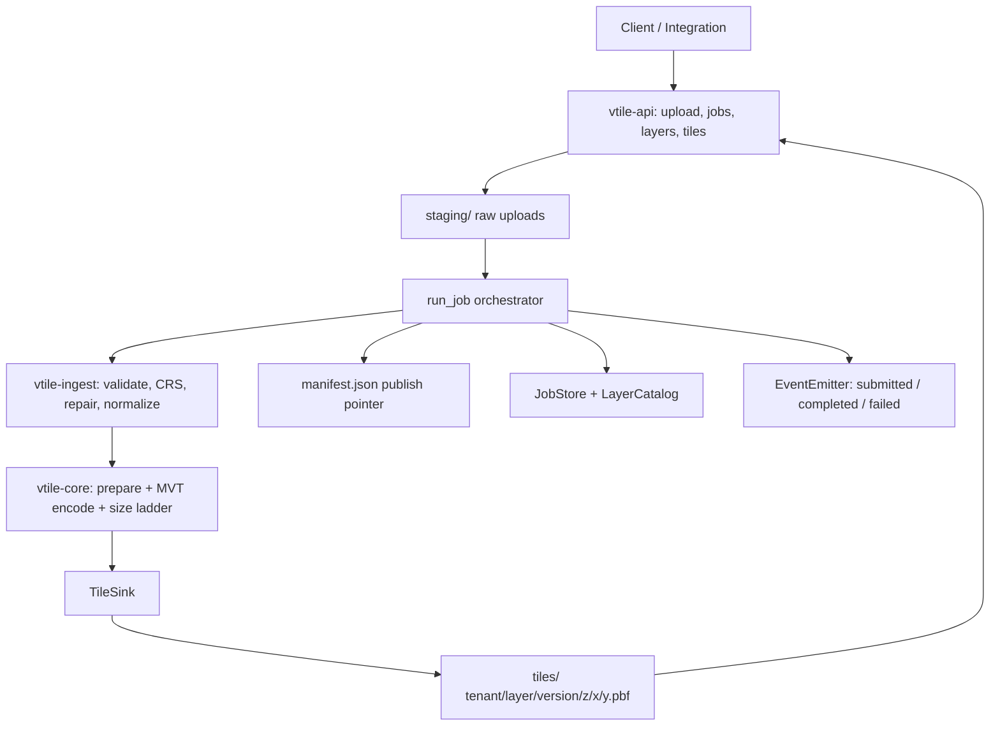

# Architecture

Vector Tile Ingestion Pipeline (TRD v0.1 implementation).

This workspace implements the MVP end-to-end: GeoJSON/Shapefile upload →
normalize to EPSG:4326 → Mapbox Vector Tile (MVT v2) generation → publish to
tile storage → serve over HTTP, with job/layer metadata and lifecycle events.

## 1. Component map: local implementation ↔ AWS production

The same domain code runs in both worlds. Everything AWS-specific sits
behind traits (`TileSink`, `JobStore`, `LayerCatalog`, `EventEmitter`), so
swapping local → production is adapter work, not a rewrite.

| Responsibility | TRD §2 production component | This workspace |
|---|---|---|
| Authenticated upload/job APIs | API Gateway + Lambda | `vtile-api` (axum handlers, same contracts) |
| Raw upload storage | S3 staging bucket | `data/staging/{tenant}/{job}/input/` |
| Upload trigger | S3 event → SQS → Step Functions | PUT handler → in-process `run_job` |
| Orchestration | Step Functions state machine | `vtile_pipeline::job::run_job` (same 12 states) |
| Format conversion / tiling compute | ECS Fargate (GDAL/Tippecanoe) | `vtile-ingest` + `vtile-core` (pure Rust, no native deps) |
| Published tiles | S3 tile bucket + CloudFront | `data/tiles/{tenant}/{layer}/{version}/z/x/y.pbf` + `/tiles/...` route |
| Job & layer metadata | DynamoDB | `FileJobStore` / `FileLayerCatalog` (trait-backed) |
| Lifecycle events | EventBridge | `LoggingEventEmitter` (same §9 JSON schemas) |
| Atomic publish / rollback | tile-version prefix + manifest | `manifests/{tenant}/{layer}/manifest.json` |



## 2. Crates

| Crate | Contents |
|---|---|
| `vtile-core` | MVT v2 protobuf encoder + decoder, tile math (Web Mercator XYZ), geometry command encoding, simplification, tile-size mitigation ladder, `TileSink` port, `generate_tiles` |
| `vtile-ingest` | GeoJSON parsing, zipped Shapefile parsing (`.shp`/`.shx`/`.dbf`/`.prj`), CRS detection/reprojection (WGS84, NAD83, EPSG:3857), geometry repair, validation, property cleaning, normalization |
| `vtile-pipeline` | Job orchestration (`run_job`), manifest, local + S3 tile sinks, job/layer stores, events, `vtile` CLI binary |
| `vtile-api` | HTTP API (TRD §8): uploads, jobs, layers, tile serving; bearer-token auth + CORS |

Dependency direction: `api → pipeline → {ingest, core}`; `ingest → core`.

## 3. Job workflow (TRD §10)

`vtile_pipeline::job::run_job` executes the Step Functions states in order:

```text
Validate Upload → Detect Format → Unpack (shapefile) → Validate CRS/Geometry
→ Normalize to GeoJSON-equivalent → Reproject to EPSG:4326 → Clean Properties
→ Generate Vector Tiles → Publish Tiles → Write Manifest → Update Catalog
→ Emit Completion Event
```

Status transitions (`UPLOAD_PENDING → QUEUED → VALIDATING → NORMALIZING →
TILING → PUBLISHING → COMPLETED | FAILED`) are persisted through the
`JobStore` at each step, mirroring Step Functions state visibility. Failures:
classify to TRD error codes, persist `FAILED`, emit `vector.tile.job.failed`.

Reliability behaviors implemented locally:
- **Idempotency** — re-running a `COMPLETED` jobId is rejected.
- **Atomic publish** — tiles are written under a fresh
  `{tileVersion}` prefix; the manifest swap makes them live. Rollback =
  repoint the manifest at a retained version (90-day retention in prod).
- **Empty tiles** are skipped; clients get `204 No Content`.

## 4. Storage layout (TRD §6 mirror)

```text
data/
  staging/{tenantId}/{jobId}/input/…          # raw upload
  staging/{tenantId}/{jobId}/normalized.geojson
  tiles/{tenantId}/{layerId}/{tileVersion}/{z}/{x}/{y}.pbf
  manifests/{tenantId}/{layerId}/manifest.json
  jobs/{jobId}.json                            # job records (DynamoDB in prod)
  catalog.json                                 # layer metadata (DynamoDB in prod)
```

Published tiles carry metadata in S3 (prod): `tenantId`, `layerId`,
`tileVersion`, `sourceFormat`, `crs`, `minZoom`, `maxZoom`
(`vtile_core::sink::TileObjectMeta`).

## 5. Tile generation strategy (TRD §5)

- **Format:** MVT v2, gzip-compressed `.pbf`, Web Mercator XYZ grid,
  extent 4096, buffer 256 units.
- **Zoom strategy:** category defaults (`LayerCategory::default_zoom_range`)
  match the TRD table (parcels 10–16, submarkets 4–12, assets 4–16,
  risk overlays 6–14, macro 0–8).
- **Precision:** no simplification at zoom ≥ 14 (`SIMPLIFY_BELOW_ZOOM`);
  see `docs/PRECISION.md` for the quantization analysis.
- **Size ladder** (target 250 KB, hard cap 750 KB gzipped):
  1. full attributes
  2. core identifiers only (`assetId`, `parcelId`, …)
  3. no attributes
  4. extra simplification (zoom < 14 only)
  5. drop lowest-value features until under the hard cap

## 6. API surface (TRD §8)

| Endpoint | Handler |
|---|---|
| `POST /api/v1/ingest/uploads` | create job, return upload URL (§8.1) |
| `PUT /api/v1/ingest/uploads/:job_id/content` | receive upload, run pipeline (local stand-in for S3 presigned upload → SQS → Step Functions) |
| `GET /api/v1/jobs/:job_id` | status + outcome summary (§8.2) |
| `GET /api/v1/layers?tenantId&category&market` | catalog list (§8.3) |
| `GET /api/v1/layers/:layer_id` | catalog entry (§8.4) |
| `GET /tiles/:tenant/:layer/:z/:x/:y.pbf` | tile serving (§8.5: 200/204/403/404/422 semantics) |
| `GET /healthz` | health check |

Security (TRD §13): bearer-token auth (MVP stand-in for OAuth2/OIDC),
tenant pinning on jobs/layers/tiles, CORS allowlist exactly as specified,
request-body limit (413), PII denylist applied before publication.

## 7. Production cutover checklist

1. Uploads: replace the PUT content handler with S3 presigned URLs
   (API Gateway returns `uploadUrl` from `s3:PresignPutObject`).
2. Trigger: S3 event notification → SQS → Step Functions (ASL scaffold in
   `terraform/step_functions/`); each state invokes the `vtile` CLI on
   ECS Fargate.
3. Tiles: enable the `aws` feature of `vtile-pipeline` to use `S3TileSink`
   (multipart-batched, SSE-KMS metadata).
4. Metadata: implement `JobStore`/`LayerCatalog` over DynamoDB
   (jobs: PK `jobId`; layers: PK `layerId`, GSI `tenantId`).
5. Events: implement `EventEmitter` over EventBridge (`source: vis.geo`).
6. Delivery: CloudFront distribution over the tile bucket; Lambda@Edge
   `OriginResponse` for 204-on-missing and gzip headers.
