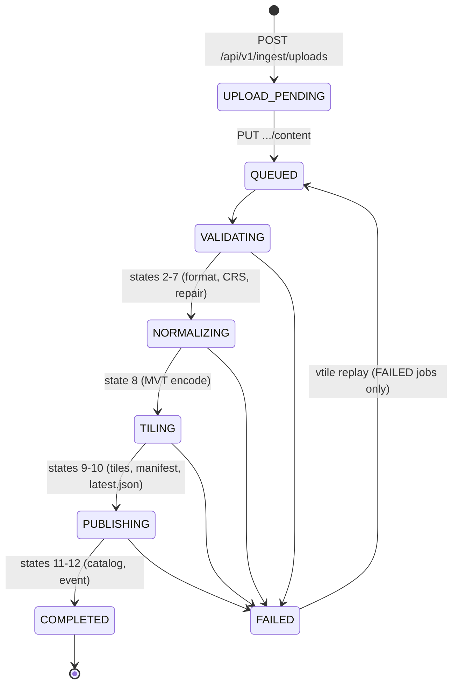

# Local Development

The entire TRD pipeline runs locally with **no cloud dependencies**: the same
domain code that runs on AWS (API Gateway → S3 → SQS → Step Functions →
Fargate → CloudFront) runs against the filesystem, with every AWS dependency
behind a trait. This document is the walkthrough for Recommendation 1 (local
end-to-end pipeline); error codes referenced here are defined in
[`ERRORS.md`](ERRORS.md).

## Quickstart

```bash
make setup      # build release binaries + generate shapefile fixtures + data dirs
make run-local  # vtile-api on 127.0.0.1:8080 (foreground)

# in a second terminal:
make seed       # push every fixture through the upload API
make smoke      # end-to-end assertions (upload → tiles → TRD §8.5 contracts)
make job-status JOB_ID=<jobId>
```

Requires Rust ≥ 1.75; the scripts additionally need `curl` and `python3`.

## How local components map to production

| Concern | Production (TRD §2) | Local equivalent |
|---|---|---|
| Upload API | API Gateway + Lambda + S3 presigned PUT | `vtile-api` `POST /api/v1/ingest/uploads` returns a local `uploadUrl` |
| Upload receiver | S3 object write | `PUT /api/v1/ingest/uploads/:job_id/content` |
| Queue / trigger | S3 event → SQS | the PUT handler enqueues work in-process (`spawn_blocking`) |
| Orchestrator | Step Functions (12 states) | `vtile_pipeline::job::run_job` runs the same states |
| Processor | ECS Fargate | the `vtile` CLI (same binary Fargate would run) |
| Tile storage | S3 `tiles/{tenant}/{layer}/{z}/{x}/{y}.pbf` | `data/tiles/{tenant}/{layer}/{version}/{z}/{x}/{y}.pbf` |
| Metadata | DynamoDB jobs/layers tables | `data/jobs/*.json` + `data/catalog.json` |
| Events | EventBridge | structured `tracing` log lines (same payload shape) |
| CDN | CloudFront | `GET /tiles/:tenant/:layer/:z/:x/:y.pbf` with the TRD §8.5 status contract |
| DLQ | SQS DLQ + redrive | `data/quarantine/` + `vtile replay` |

## Make target reference

| Target | What it does |
|---|---|
| `make help` | List targets (default) |
| `make build` | Release binaries: `target/release/vtile-api`, `target/release/vtile` |
| `make fixtures` | Generate `tests/fixtures/*.zip` shapefile bundles (byte-exact writer output) |
| `make setup` | `build` + `fixtures` + create the local "bucket" dirs under `data/` |
| `make setup-docker` | `docker compose up -d --build` (api + worker) |
| `make run-local` | Run the API in the foreground (release binary if built, else `cargo run`) |
| `make run-local-docker` | Run the API via compose |
| `make seed` | `scripts/seed.sh` — push every fixture through the upload API |
| `make smoke` | `scripts/smoke.sh` — healthz, happy path, tile fetch, 204/404/422 contracts |
| `make job-status JOB_ID=job_...` | Job status in the production `GET /jobs/{jobId}` response shape |
| `make replay-job TENANT=t JOB_ID=job_... [ASSUME_WGS84=1]` | Replay a failed, quarantined job |
| `make test` | `cargo test --workspace` |
| `make clean` / `make distclean` | Remove `data/` (+ `target/`) |

Overrides: `make run-local PORT=9090 HOST=0.0.0.0`, and `API_BASE=...`,
`TENANT=...` for the scripts.

## Local data layout

```text
data/                                  # local mirror of TRD §6 S3 prefixes
  staging/{tenantId}/{jobId}/
    input/{fileName}                   # raw upload
    normalized.geojson                 # EPSG:4326 normalization artifact
  tiles/{tenantId}/{layerId}/{tileVersion}/{z}/{x}/{y}.pbf
  manifests/{tenantId}/{layerId}/
    manifest.json                      # publish pointer (TRD §14 atomic swap)
    latest.json                        # stable live pointer, identical content
  quarantine/{tenantId}/{jobId}/
    input.bin                          # original upload bytes
    error-report.json                  # ErrorReport (code, stage, message, ...)
  dedupe/{sha256_fingerprint}.json     # accepted-event dedupe records (Sequence 1 US-03)
  orphans/{timestamp}-{hash}.json      # events with no resolvable job (US-01/US-03)
  jobs/{jobId}.json                    # job records (DynamoDB stand-in)
  catalog.json                         # layer catalog (DynamoDB stand-in)
```

The CLI (`vtile`) and the API share this layout exactly, so layers published
by one are visible to the other.

## Job lifecycle

States are the TRD §10 workflow, persisted to `data/jobs/{jobId}.json` at
every transition. `failedStage` on a failed job names the stage that errored.
Every write bumps `stateVersion`, and runs hold a 15-minute worker lease
(`leaseToken`/`lockedBy`/`leaseExpiresAt`) so only one processor owns a job
at a time — see [`IDEMPOTENCY.md`](IDEMPOTENCY.md).



## HTTP walkthrough

```bash
# 1. Create the job (TRD §8.1); optional Idempotency-Key header makes
#    repeat requests converge on the same job (Sequence 1 US-01)
curl -s -X POST localhost:8080/api/v1/ingest/uploads \
  -H 'Content-Type: application/json' \
  -H 'Idempotency-Key: nyc-parcels-2026-06-17' \
  -d '{"tenantId":"tenant-acme","layerId":"us-parcels-fx",
       "fileName":"simple-parcels.geojson","contentType":"application/geo+json",
       "sourceFormat":"GEOJSON",
       "metadata":{"name":"Fixture Parcels","category":"PARCEL","tags":["parcel","nyc"]}}'

# 2. Upload the bytes (local stand-in for the S3 presigned PUT) and process
curl -s -X PUT localhost:8080/api/v1/ingest/uploads/{jobId}/content \
  -H 'Content-Type: application/geo+json' \
  --data-binary @tests/fixtures/simple-parcels.geojson

# 3. Poll status (TRD §8.2) — includes errorCode/failedStage on failure
curl -s localhost:8080/api/v1/jobs/{jobId}

# 4. Browse the catalog (TRD §8.3/§8.4)
curl -s 'localhost:8080/api/v1/layers?tenantId=tenant-acme&category=PARCEL&market=nyc'

# 5. Fetch tiles (TRD §8.5: 200 tile / 204 empty / 404 unknown / 422 zoom)
curl -s -o tile.pbf localhost:8080/tiles/tenant-acme/us-parcels-fx/14/4824/6157.pbf
```

A `category` supplies the TRD §5 default zoom range (PARCEL → 10–16); override
it per request with `requestedZoomRange: {"minZoom":..,"maxZoom":..}`. To
assume WGS84 for a `.prj`-less shapefile at upload time, send
`"assumeCrsWgs84": true` (equivalently, tag `assume-wgs84`).

## Failure and replay walkthrough

Seed the failure fixtures (`make seed`), then:

```bash
# invalid-polygon.geojson fails normalization and is quarantined:
make job-status JOB_ID=<jobId>
#   status: FAILED, errorCode: GEOMETRY_ERRORS, failedStage: NORMALIZING
cat data/quarantine/tenant-acme/<jobId>/error-report.json

# missing-prj.zip fails with UNKNOWN_CRS; replay it with user-confirmed WGS84
# (TRD §10 "require user confirmation"):
make replay-job TENANT=tenant-acme JOB_ID=<jobId> ASSUME_WGS84=1

# replays record who/why (Sequence 1 US-05):
vtile replay --data-dir ./data --tenant tenant-acme --job-id <jobId> \
  --requested-by sre-user --reason "Transient Fargate timeout" --assume-wgs84
```

Replay semantics (Recommendation 3 US-03, Sequence 1 US-05): `FAILED` jobs
replay; `COMPLETED` jobs replay only with `--create-new-version`; active jobs
are rejected with `JOB_ALREADY_ACTIVE`; `CANCELLED` jobs never replay. The
tenant must match, the job re-enters at `QUEUED` with its error fields and
stale lease cleared, an audit record (`replayAudit`) is persisted, and
each run mints a fresh `tileVersion` swapped in atomically — so a replay
either publishes a complete new version or leaves the previous one
untouched. Duplicate uploads and redelivered events are suppressed
automatically; the counters are visible at `GET /internal/metrics`.

## CLI reference (`vtile`)

The same binary is the Fargate entrypoint in production (TRD §11 Decision 2).

```bash
vtile run --tenant tenant-acme --layer us-parcels-nyc \
    --format shapefile --input parcels.zip --data-dir ./data \
    --category parcel [--min-zoom 10 --max-zoom 16] [--assume-wgs84] [--normalize-only]
vtile inspect-tile ./data/tiles/.../14/4824/6157.pbf
vtile job-status --data-dir ./data --job-id job_...
vtile replay --data-dir ./data --tenant tenant-acme --job-id job_... \
    [--assume-wgs84] [--requested-by NAME] [--reason TEXT] [--create-new-version]
```

`--normalize-only` stops after the normalization artifact (states 1–7) and
prints the feature count, warnings, and bbox — useful for debugging a source
file without tiling it.

## Docker

```bash
make setup-docker                # api (:8080) + worker, ./data mounted
docker compose exec worker vtile job-status --data-dir /data --job-id job_...
docker compose --profile aws up -d   # additionally start MinIO (see below)
```

The `aws` profile adds MinIO + bucket creation. It is reserved for the S3 tile
sink (`vtile-pipeline` built with `--features aws`, whose
`aws_config::load_from_env()` honors `AWS_ENDPOINT_URL`); the default local
flow is filesystem-backed and does not use it.

## Configuration reference

API flags (`vtile-api`):

| Flag | Default | Purpose |
|---|---|---|
| `--data-dir` | `data` | Root for staging/tiles/manifests/jobs/quarantine/catalog |
| `--host` / `--port` | `127.0.0.1` / `8080` | Bind address |
| `--auth-token` | off | Static bearer token (pins callers to their tenant); production uses OAuth2/OIDC |
| `--max-upload-bytes` | 2 GiB | TRD §10 `PAYLOAD_TOO_LARGE` limit |

Environment:

| Variable | Default | Purpose |
|---|---|---|
| `RUST_LOG` | `vtile_api=info,vtile_pipeline=info` (API), `info` (CLI) | `tracing` filter |
| `API_BASE` | `http://127.0.0.1:8080` | scripts/seed.sh, scripts/smoke.sh |
| `TENANT` | `tenant-acme` | scripts/seed.sh, scripts/smoke.sh |
| `AWS_ENDPOINT_URL`, `AWS_*` | — | only with `--features aws` (S3 sink) |

Ops endpoint: `GET /internal/metrics` returns the idempotency telemetry
snapshot (Sequence 1 US-06); `make metrics` wraps it.

## Parity notes

- **Same contracts, different transports.** Request/response shapes, the
  tile status-code contract, event payloads, and the error taxonomy
  (`docs/ERRORS.md`) match production exactly; only the transport differs.
- **Idempotency is real, the store is emulated.** Conditional creates,
  version-checked transitions, leases, dedupe, orphan handling, and replay
  guardrails run in-process against the filesystem; DynamoDB provides the
  atomic conditionals in production (`docs/IDEMPOTENCY.md`).
- **No real queue.** The PUT handler starts processing in-process; the TRD
  "job start < 30 s" NFR is trivially met locally.
- **File stores instead of DynamoDB.** Single-file catalog (`catalog.json`) —
  fine for MVP layer counts; DynamoDB replaces it via the same traits.
- **Presigned URLs are emulated.** `uploadUrl` points back at the local API
  instead of S3.
