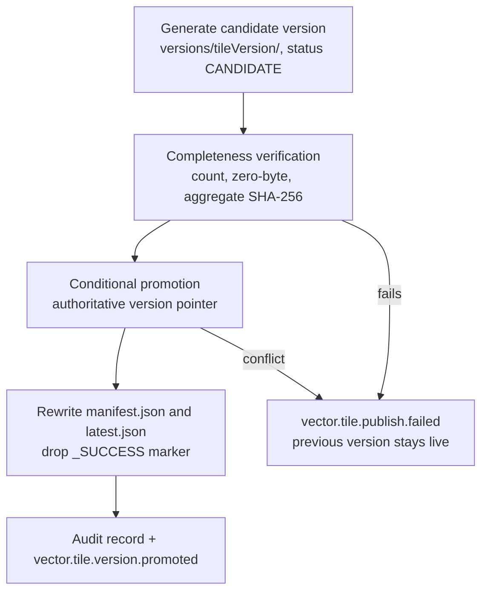

# Atomic Publishing (Sequence 2)

CRE users must always see either the **previous known-good layer version** or
the **new fully published version** — never a partially published tileset.
Partial parcel, flood, or zoning data corrupts valuation, comps, and risk
analysis, so publishing is versioned, verified, atomic, auditable, and
rollback-capable.

**Key architectural rule:** tile generation never writes directly to the live
path.



## Path conventions (US-AP-01)

```text
tiles/{tenantId}/{layerId}/versions/{tileVersion}/{z}/{x}/{y}.pbf
tiles/{tenantId}/{layerId}/versions/{tileVersion}/_manifest/candidate.json
tiles/{tenantId}/{layerId}/versions/{tileVersion}/_SUCCESS
manifests/{tenantId}/{layerId}/publication.json   # authoritative version record
manifests/{tenantId}/{layerId}/manifest.json      # compatibility pointer
manifests/{tenantId}/{layerId}/latest.json        # atomic live pointer
manifests/{tenantId}/{layerId}/audit.jsonl        # append-only audit trail
```

- `tileVersion` is a TRD-format timestamp plus a short unique suffix
  (`2026-06-17T16-00-00Z-a1b2c3d4`). TRD open question 3 leaves the scheme
  open; the suffix prevents same-second collisions on one layer.
- Candidate versions are **immutable after promotion** — rollback never
  regenerates tiles, it repoints.
- In-progress jobs write only inside their own candidate directory; the read
  path cannot reach it, so a failing or mid-flight job exposes nothing.

## Candidate manifest and verification (US-AP-02)

At the end of tile generation the pipeline writes
`_manifest/candidate.json` (Sequence 2 epic schema): `status: CANDIDATE`,
`sourceJobId`, zoom range, `featureCount`, `tileCount`, `boundingBox`,
`checksumAlgorithm: SHA-256`, `aggregateChecksum`, `tileRoot`.

Promotion is gated on `verify_candidate`:

| Check | Failure code |
|---|---|
| Candidate manifest present and well-formed | `PUBLISH_VALIDATION_FAILED` |
| On-disk tile count == manifest `tileCount` | `PUBLISH_VALIDATION_FAILED` |
| No zero-byte `.pbf` (empty regions are absent tiles, not empty files) | `PUBLISH_VALIDATION_FAILED` |
| Every zoom in `minZoom..=maxZoom` has tiles | `PUBLISH_VALIDATION_FAILED` |
| Aggregate checksum re-derived from disk matches | `PUBLISH_VALIDATION_FAILED` |

The aggregate checksum is SHA-256 over the canonicalized per-tile records
(`rel_path`, per-tile SHA-256, size — sorted by path), recorded during
generation and re-derived from disk at verification. The `_SUCCESS` marker is
written after verification passes but is **never the sole source of
publication truth** — promotion still requires the registry update.

## Atomic promotion (US-AP-03)

The authoritative layer record (`publication.json`, the local analog of the
DynamoDB record) owns `currentTileVersion`:

```json
{
  "layerId": "nyc_parcels",
  "tenantId": "tenant_acme",
  "currentTileVersion": "2026-06-17T16-00-00Z-a1b2c3d4",
  "previousTileVersion": "2026-05-01T10-00-00Z-9f8e7d6c",
  "publishStatus": "PUBLISHED",
  "updatedAt": "2026-06-17T16:10:00Z",
  "publishedBy": "pipeline:vtile-publisher"
}
```

Promotion is a **conditional update**: it succeeds only when the stored
`currentTileVersion` equals the publisher's `expectedPrevious` (`None` for a
layer's first publish). Two concurrent publishers for one layer → exactly one
wins; the loser gets `PromotionConflict` (`PROMOTION_CONFLICT`), the job
fails, and the previous version remains active. After the pointer moves,
`manifest.json`/`latest.json` are rewritten (latest atomically) and the audit
record + `vector.tile.version.promoted` event are emitted.

## Consistent read path (US-AP-04)

- **Stable URL:** `GET /tiles/{tenant}/{layer}/{z}/{x}/{y}.pbf` — the server
  resolves `currentTileVersion` from `publication.json` (fallback:
  `manifest.json` for pre-registry layers). Every tile in a session comes
  from one version; an in-progress publish keeps serving the previous one.
- **Explicit URL:** `GET /tiles/{tenant}/{layer}/versions/{version}/{z}/{x}/{y}.pbf`
  — serves the named immutable version regardless of promotion state
  (pinning, validation, rollback verification).
- Layer metadata (`GET /api/v1/layers/{layerId}`) carries `tileVersion` and
  `tileUrlTemplate` so clients can resolve versions themselves.
- Missing tiles are `204 No Content` (TRD §8.5) — the pipeline never mixes
  old and new tiles as a fallback; absence is explicit.
- Locally there is no cache; production maps onto CloudFront with a short TTL
  (30–60 s) on version resolution and cache invalidation for urgent
  rollbacks.

## Rollback (US-AP-05)

Rollback repoints the authoritative record — **no reprocessing**:

```bash
# CLI
vtile rollback --data-dir ./data --tenant tenant-acme --layer us-parcels-nyc \
  --target-version 2026-05-01T10-00-00Z-9f8e7d6c \
  --reason "Parcel boundaries misaligned after vendor refresh" \
  --requested-by sre:oncall
# or: make rollback-layer TENANT=... LAYER=... TARGET_VERSION=... REASON="..."
```

```http
POST /api/v1/ops/layers/{layerId}/rollback
{ "targetTileVersion": "2026-05-01T10-00-00Z-9f8e7d6c",
  "reason": "Parcel boundaries misaligned after vendor refresh" }
```

Rules:

| Stored state / request | Outcome |
|---|---|
| Target is a retained version with its candidate manifest | pointer moves; `publishStatus: ROLLED_BACK`; manifests rewritten |
| Target == current version | idempotent no-op (no audit entry) |
| Unknown/missing target | rejected: `ROLLBACK_FAILED` / `422 ROLLBACK_INVALID_TARGET` |
| No reason supplied | rejected (auditability, US-AP-06) |
| Layer never published | rejected |

Rollback emits `vector.tile.version.rolled_back` and appends a `ROLLBACK`
audit record with actor + reason. Retention: TRD §6 keeps prior versions for
90 days, which bounds the rollback window. CRE scenarios covered: misaligned
county parcel refreshes, flood-overlay shifts affecting risk analysis,
zoning layers missing dense urban features.

## Governance and audit (US-AP-06)

Every publish and rollback appends to `audit.jsonl` (append-only locally;
DynamoDB/data-lake with restricted access in production):

```json
{ "auditId": "audit_...", "tenantId": "tenant_acme", "layerId": "nyc_parcels",
  "action": "PUBLISH", "fromTileVersion": null,
  "toTileVersion": "2026-06-17T16-00-00Z-a1b2c3d4",
  "actor": "pipeline:vtile-publisher", "sourceJobId": "job_...",
  "reason": null, "occurredAt": "2026-06-17T16:10:00Z" }
```

- Any version traces back to its originating job (`sourceJobId`) and source
  dataset via the job record's `sourceUri`.
- Actors: `pipeline:vtile-publisher` (automated), `cli` / `api:{tenant}`
  (manual rollback). Production enforces role-restricted publish/rollback via
  API Gateway/IAM; manual rollback always requires a reason.
- Events: `vector.tile.version.promoted`, `vector.tile.version.rolled_back`,
  `vector.tile.publish.failed`.

## Telemetry

`GET /internal/metrics` merges the publish counters with the idempotency
telemetry: `versions_published`, `promotion_conflicts`,
`publish_validation_failures`, `rollbacks_completed`.

## Test matrix (`tests/atomic_publish.rs`)

- Candidate isolation: only `versions/` exists; registry, `latest.json`,
  `_SUCCESS`, audit, promoted event all present (US-AP-01/03/06)
- Verification gates: missing tile, zero-byte tile, corrupted tile,
  `PUBLISH_VALIDATION_FAILED` classification (US-AP-02)
- Aggregate checksum order-independence + content sensitivity (US-AP-02)
- Conditional promotion: one winner, stale publisher loses, pointer intact
  (US-AP-03)
- Second publish advances pointer and retains the previous version directory
  (US-AP-03/05)
- Rollback restores the previous version, rewrites pointers, audits, emits
  (US-AP-05/06); idempotent no-op; invalid targets rejected (US-AP-05)

## Local → production mapping

| Local | Production (TRD §2/§11) |
|---|---|
| `versions/{v}/` on disk | S3 versioned output prefix |
| `publication.json` conditional update | DynamoDB `ConditionExpression` on `currentTileVersion` |
| `verify_candidate` directory walk | S3 listing + sampled checksums / per-zoom manifests for very large layers |
| `audit.jsonl` | DynamoDB/data-lake audit table (tamper-evident, long retention) |
| `LoggingEventEmitter` | EventBridge |
| `/tiles/...` registry resolution | CloudFront Function / Lambda@Edge rewriting stable URLs to the current version |
